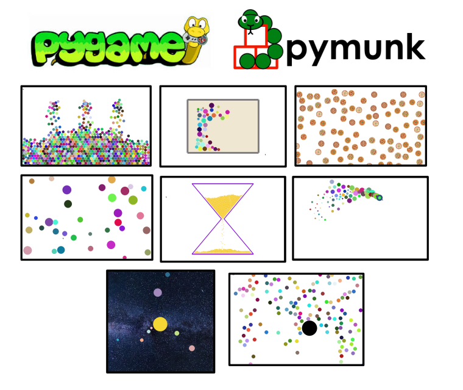

# Funny Simulations  [Python, Pygame, Pymunk]

In this project, you will find the implementations of different **funny simulations** to **learn how to use** ```Python```, ```Pygame```, and ```Pymunk```.

The simulations presented here can be **customized as you want**. Each directory has its own ```config.yml``` with all the parameters and variables that can be modified. Each python file is duly commented, they are intended to be easy to read and understand. Each simulation is independent of the rest.

**I hope you enjoy all of them, have fun, and learn a lot! :)**



## 1) [Colorful Flooding](./colorful_flooding)

**Description:**
- In this simulation, some sources generate balls that fill the screen until you press the ```Space Bar```. When the ```Space Bar``` is pressed, no more
balls are generated. Instead, the balls fall and disappear until there are zero of them, and the simulation ends.

**Controls:**
- ```Space Bar```: to stop generating balls. The remaining balls will fall out of the screen.

**Customize:**
  - the screen: width, height
  - the physics: gravity, mass, radius, elasticity, friction
  - the structure: number of sources, frequency of ball creation
  - the colors: background

 


## 2) [Gravity Controller](./gravity_controller)
 
**Description:**
- In this simulation, you will use your **computer mouse** to change the magnitude and direction of the gravity of the Pymunk Space. In the center of
the screen, there is a static box with some dynamic balls inside. These balls will move attracted by gravity. In other words, the balls will move toward
the mouse position at each time step.

**Controls:**
- ```Mouse position```: Move your mouse to guide the balls.

**Customize:**
  - the screen: width, height
  - the physics: gravity, mass, radius
  - the structure: number of balls, box size, box structure
  - the colors: background, box

 


## 3) [Pizza Rain](./pizza_rain)
 **Description:**
- In this simulation, there are a lot of pizzas falling down the screen while they rotate. You are allowed to use your keyboard to change the fall speed and the rotation
speed as well. The images of pizzas used here are found in [```pizza_rain/images```](./pizza_rain/images)

**Controls:**
- ```Space Bar```: pause/resume the simulation
- ```→```: increase rotation frequency
- ```←```: decrease rotation frequency
- ```↓```: increase fall speed
- ```↑```: decrease fall speed

**Customize:**
  - the screen: width, height
  - the physics: vertical speed, rotation frequency
  - the structure: number of pizzas, their diameter, the images used

 


## 4) [Rebound Collisions](./rebound_collisions)
 **Description:**
- In this simulation, you will use your mouse to create new Circles of different colors that will move across the screen while colliding with each other. There is no gravity here. You are allowed (and encouraged) to change the physics and features of the simulation.

**Controls:**
- ```Mouse Click```: to create a new ball in the mouse position

**Customize:**
  - the screen: width, height
  - the physics: mass, moment, radius, velocity
  - the colors: background

 


## 5) [Sand Clock](./sand_clock)
 **Description:**
- In this simulation, there is a [Sand Clock](https://en.wikipedia.org/wiki/Hourglass) that contains some sand grains that flow from the upper bulb to the lower one by gravity. You are allowed to tip over the clock or restart the simulation.

**Controls:**
- ```Space Bar```: tip over the sand clock
- ```R```: restart the simulation

**Customize:**
  - the screen: width, height
  - the physics: mass, radius, gravity
  - the structure: width, height, neck, lines, number of sand grains
  - the colors: background, sand grains, sand clock structure


## 6) [Shooting Star](./shooting_star)
 **Description:**
- In this simulation, you will use your computer mouse to create a **colorful shooting star**. You have to hold down your mouse while you move it in order to create the shooting star effect. When you press the mouse some sparks will be created, but will eventually vanish in a few seconds.

**Controls:**
- ```Mouse Hold Down```: move your mouse to create the shooting star effect.

**Customize:**
  - the screen: width, height
  - the physics: radius, gravity
  - the structure: spark lifespan, new sparks per time-steps
  - the colors: background

 

## 7) [Solar System](./solar_system)
 **Description:**
- This is a zero-player simulation that simulates our Solar System. In the center of the screen, there is the Sun (since it is the center of the actual SolarSystem). Several planets orbit around the Sun, but they do not represent actual Planets.

**Controls:**
- None. It is a zero-player simulation.

**Customize:**
  - the screen: width, height
  - the physics: translation period for each planet
  - the structure: number of planets, radius, distances
  - the colors: background, color of each planet

 


 ## 8) [Wrecking Ball](./wrecking_ball)
 **Description:**
- This is a zero-player simulation in which there is a wrecking ball that moves across the screen and collides with other small balls (it runs over them actually) that fall from the top of the screen.

**Controls:**
- None. It is a zero-player simulation.

**Customize:**
  - the screen: width, height
  - the physics: radius, mass, velocity, elasticity, friction, gravity
  - the colors: background, wrecking ball color

 


## Getting started

First, ensure you have [Python](https://www.python.org/downloads/) installed.

Before installing the Python libraries used in this project, you may want to create a Python Virtual Environment ([venv](https://docs.python.org/3/library/venv.html)), to avoid problems if you are working on other projects as well.

The Python Libraries used in this project are listed in the ```requirements.txt``` file. There you will find the Python libraries and their versions. You may use a package manager called ```pip``` to install them. If ```pip``` is not installed, you need to install it. If you have *Python 3.4* or newer, ```pip``` should come pre-installed.

Run the following command to install the libraries listed in your requirements.txt file:
```
pip install -r requirements.txt
```
After running the command, pip will download and install the specified packages and their dependencies. You can verify that the libraries were successfully installed by checking their versions:
```
pip list
```

## About Pygame
[Pygame](https://www.pygame.org/docs/) is a cross-platform set of Python modules designed for writing video games. It provides a simple way to create games and multimedia applications. It provides a straightforward and efficient way to manage graphics, sound, user input, and basic collision detection. In this project, Pygame is used to create a graphical interface for every simulation.

## About Pymunk
[PyMunk](https://www.pymunk.org/en/latest/pymunk.html) is a Python library that extends Pygame by adding robust 2D physics simulation capabilities, allowing developers to create realistic physics interactions within their 2D games and simulations. It provides functionality for creating and managing physics objects such as rigid bodies, shapes, constraints, and handling complex collision detection and response.

PyMunk's integration with Pygame simplifies the process of combining graphics with dynamic physics, making it a valuable tool for those seeking to develop games or simulations with compelling and lifelike physics behavior.

## About YAML
[YAML](https://yaml.org/spec/1.2.2/) (*"Yet Another Markup Language"*) is a human-readable data serialization format. It's often used for configuration files, data exchange between languages with different data structures, and in various applications where data needs to be stored, transmitted, or configured in a human-readable format. YAML's design aims to be simple and easy for both humans to read and write and for machines to parse and generate.

## License
This project is licensed under the MIT License. See the [LICENSE file](./LICENSE) for details.

## Hope you enjoyed it! Thanks! :)
